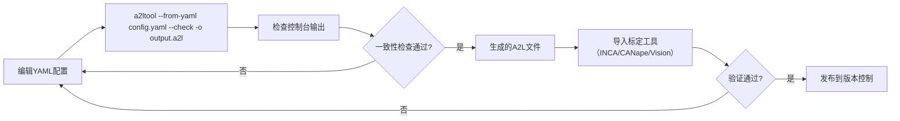

# A2L YAML 配置说明书

> **针对 a2ltool 工具的 YAML 输入格式参考手册**
>
> 版本: 2.0 | A2L标准: 1.71 | 最后更新: 2026-05-22

---

## 目录

1. [概述](#1-概述)
2. [配置结构总览](#2-配置结构总览)
3. [根节点 → a2l_config](#3-根节点--a2l_config)
4. [项目信息 → project](#4-项目信息--project)
5. [转换方法 → compu_methods](#5-转换方法--compu_methods)
6. [记录布局 → record_layouts](#6-记录布局--record_layouts)
7. [观测量 → measurements](#7-观测量--measurements)
8. [标定量 → characteristics](#8-标定量--characteristics)
9. [组织分组 → groups](#9-组织分组--groups)
10. [字段取值参考](#10-字段取值参考)
11. [配置项关联关系](#11-配置项关联关系)
12. [最佳实践](#12-最佳实践)
13. [完整示例](#13-完整示例)

---

## 1. 概述

### 1.1 什么是 A2L YAML 配置

A2L YAML 配置是一种用 YAML 格式描述 ECU 标定描述的配置方案。通过将复杂的 A2L (ASAP2) 文件结构的各要素（观测量、标定量、转换方法、记录布局等）组织为树形 YAML 结构，提供了更高可读性和更低出错率的配置方式。

### 1.2 工具支持

`a2ltool` 支持从 YAML 配置生成 A2L 文件，并可生成配置示例模板：

```bash
# 从 YAML 生成 A2L 文件
a2ltool --from-yaml config.yaml --check --sort -o output.a2l

# 生成 YAML 配置示例模板
a2ltool --yaml-example -o config.yaml

# 也可配合其他 a2ltool 功能
a2ltool --from-yaml config.yaml -e firmware.elf --update -o output.a2l
```

### 1.3 文件层级结构

YAML 配置文件使用树形结构组织 A2L 元素，顶层键为 `a2l_config`，其下按功能划分不同区块。

```yaml
a2l_config:
  version: "1.71"
  project:
    name: "..."
    module_name: "..."
  compu_methods:
    - name: "..."
  record_layouts:
    - name: "..."
  measurements:
    - name: "..."
  characteristics:
    - name: "..."
  groups:
    - name: "..."
```

---

## 2. 配置结构总览

### 2.1 完整结构层次

下表列出了所有可用配置区块及其层级关系（✅ = 必填, ◐ = 有条件必填, ⬜ = 可选）：

```
a2l_config                          ✅ 根节点
├── version                         ⬜ A2L版本号
├── project                         ✅ 项目配置
│   ├── name                        ✅ 项目名称
│   └── module_name                 ⬜ 模块名称
├── compu_methods[]                 ⬜ 转换方法列表（至少1个）
│   ├── name                        ✅ 方法名称
│   ├── type                        ✅ 转换类型
│   ├── format                      ✅ 显示格式
│   ├── unit                        ⬜ 物理单位
│   ├── coeffs_linear               ◐ LINEAR类型必填
│   │   ├── a                       ✅ 缩放系数
│   │   └── b                       ✅ 偏移量
│   └── value_pairs[]               ◐ TAB类型必填
│       ├── in                      ✅ 输入值
│       └── out                     ✅ 输出值（字符串）
├── record_layouts[]                ⬜ 记录布局列表（至少1个）
│   ├── name                        ✅ 布局名称
│   └── fnc_values                  ✅ 值字段描述
│       ├── position                ✅ 位置序号
│       ├── datatype                ✅ 数据类型
│       ├── index_mode              ✅ 索引模式
│       └── address_type            ✅ 地址类型
├── measurements[]                  ⬜ 观测量列表
│   ├── name                        ✅ 名称
│   ├── description                 ⬜ 描述/长标识符
│   ├── datatype                    ✅ 数据类型
│   ├── compu_method                ✅ 关联转换方法名称
│   ├── resolution                  ⬜ 分辨率（默认0）
│   ├── accuracy                    ⬜ 精度（默认0.0）
│   ├── lower_limit                 ✅ 下限
│   ├── upper_limit                 ✅ 上限
│   ├── ecu_address                 ✅ ECU内存地址（十六进制）
│   ├── unit                        ⬜ 物理单位
│   ├── format                      ⬜ 显示格式覆盖
│   ├── byte_order                  ⬜ 字节序（高级）
│   ├── bit_mask                    ⬜ 位掩码（高级）
│   ├── virtual_measurement         ⬜ 虚拟量标记（高级）
│   └── address_type                ⬜ 地址类型（高级）
├── characteristics[]               ⬜ 标定量列表
│   ├── name                        ✅ 名称
│   ├── description                 ⬜ 描述/长标识符
│   ├── type                        ✅ 标定量类型
│   ├── datatype                    ✅ 数据类型
│   ├── ecu_address                 ✅ ECU内存地址
│   ├── record_layout               ✅ 关联记录布局名称
│   ├── compu_method                ✅ 关联转换方法名称
│   ├── lower_limit                 ✅ 下限
│   ├── upper_limit                 ✅ 上限
│   ├── format                      ⬜ 显示格式覆盖
│   ├── monotony                    ⬜ 单调性（CURVE/MAP类型）
│   ├── axis_descr_x                ⬜ X轴描述（CURVE/MAP类型）
│   └── axis_descr_y                ⬜ Y轴描述（MAP类型）
└── groups[]                        ⬜ 组织分组列表
    ├── name                        ✅ 分组名称
    ├── description                 ⬜ 描述
    ├── root                        ⬜ ROOT属性（布尔值，默认false）
    ├── sub_groups[]                ⬜ 子分组引用列表
    └── members[]                   ✅ 组成员列表
        ├── type                    ✅ 成员类型（MEASUREMENT/CHARACTERISTIC）
        └── name                    ✅ 成员名称（须与定义的一致）
```

### 2.2 必填/可选判定逻辑

| 条件 | 结论 |
|------|------|
| `project.name` | **始终必填**，作为 A2L 文件的 `PROJECT` 名称 |
| `compu_methods` 列表为空 | 生成默认 LINEAR 转换方法 |
| `record_layouts` 列表为空 | 生成默认 ScalarRecordLayout |
| `measurements` 列表为空 | 不会生成任何 MEASUREMENT 块 |
| `characteristics` 列表为空 | 不会生成任何 CHARACTERISTIC 块 |
| `groups` 列表为空 | 不会生成任何 GROUP 块 |
| `type` = LINEAR | **必须**提供 `coeffs_linear` |
| `type` = TAB_NOINTP / TAB_INTP / TAB_VERB | **必须**提供 `value_pairs` |
| `compu_method` 字段引用的名称 | 必须在 `compu_methods` 列表中定义 |
| `record_layout` 字段引用的名称 | 必须在 `record_layouts` 列表中定义 |

---

## 3. 根节点 → a2l_config

### 3.1 字段说明

| 字段 | 类型 | 必填 | 说明 |
|------|------|:----:|------|
| `a2l_config` | object | ✅ | YAML 配置的根键，必须作为最顶层键存在 |
| `version` | string | ⬜ | A2L 标准版本号（如 `"1.71"`），仅作为元数据记录 |

### 3.2 示例

```yaml
a2l_config:
  version: "1.71"
```

---

## 4. 项目信息 → project

### 4.1 字段说明

| 字段 | 类型 | 必填 | 说明 |
|------|------|:----:|------|
| `name` | string | ✅ | **项目名称**。对应 A2L 中的 `/begin PROJECT` 名称。必须是有效的 A2L 标识符（字母开头，不含特殊字符） |
| `module_name` | string | ⬜ | **模块名称**。对应 A2L 中的 `/begin MODULE` 名称，暂仅作为元数据记录 |

### 4.2 示例

```yaml
project:
  name: "EngineControlProject"
  module_name: "EngineControlModule"
```

### 4.3 命名规范

- 必须以字母或下划线开头
- 只能包含字母、数字、下划线
- 区分大小写
- 建议使用帕斯卡命名法（PascalCase）

---

## 5. 转换方法 → compu_methods

### 5.1 概述

`COMPU_METHOD`（Conversion Method）定义了 ECU 原始值与物理值之间的转换规则。每个测量值或标定值通过 `compu_method` 字段引用一个已定义的转换方法。

### 5.2 字段说明

| 字段 | 类型 | 必填 | 默认值 | 说明 |
|------|------|:----:|:------:|------|
| `name` | string | ✅ | - | 转换方法名称，必须唯一，被 measurement/characteristic 引用 |
| `type` | string | ✅ | - | 转换类型。详见下方 [转换类型枚举](#101-转换类型-conversiontype) |
| `format` | string | ✅ | - | **显示格式**。C语言 printf 风格的格式字符串，如 `"%.3f"`、`"%5.1"`。在 COMPU_METHOD 层级设定所有引用该方法的变量的默认格式 |
| `unit` | string | ⬜ | `""` | **物理单位**。如 `"RPM"`、`"%"`、`"degC"`。推荐使用纯 ASCII 字符（见[最佳实践](#124-单位兼容性处理)） |
| `coeffs_linear` | object | ◐ | - | **线性转换系数**。仅 `type: LINEAR` 时必填，包含 `a` 和 `b` 两个子字段 |
| `value_pairs` | array | ◐ | - | **值映射表**。仅 `type: TAB_NOINTP/TAB_INTP/TAB_VERB` 时必填 |

### 5.3 coeffs_linear（线性转换系数）

用于 `LINEAR` 类型的转换公式：`物理值 = a × 原始值 + b`（A2L标准: `PHYS = a * INT + b`）

| 字段 | 类型 | 必填 | 说明 |
|------|------|:----:|------|
| `a` | number | ✅ | 缩放系数（Scaling Factor），对应 A2L `COEFFS_LINEAR` 第一个参数 |
| `b` | number | ✅ | 偏移量（Offset），对应 A2L `COEFFS_LINEAR` 第二个参数 |

**常见配置模式：**

```
┌─────────────────────────────────────────────────┐
│  场景              a       b       说明          │
├─────────────────────────────────────────────────┤
│  直通模式          1.0     0.0     PHYS = INT     │
│  百分比转换        1.0     0.0     原始值即百分比  │
│  电压→物理值       scale   offset  自定义线性映射  │
│  温度转换          1.0     -40     原始值有偏移    │
└─────────────────────────────────────────────────┘
```

### 5.4 value_pairs（值映射表）

用于 `TAB_NOINTP`（数值查表）和 `TAB_VERB`（字符串查表）。每个值对将一个输入数值映射到一个输出值。

| 字段 | 类型 | 必填 | 说明 |
|------|------|:----:|------|
| `in` | number | ✅ | 输入值（ECU原始值） |
| `out` | string | ✅ | 输出值。`TAB_VERB` 时为任意字符串；`TAB_NOINTP` 时必须为数字字符串 |

### 5.5 完整示例

```yaml
compu_methods:
  # ── 线性直通（PHYS = INT）──
  - name: "LinearCompuMethod"
    type: "LINEAR"
    format: "%.3f"
    unit: ""
    coeffs_linear:
      a: 1.0  # 缩放系数
      b: 0.0  # 偏移量

  # ── 状态查表：离散状态 ──
  - name: "StatusTable"
    type: "TAB_VERB"        # 字符串输出必须用TAB_VERB
    format: "%5.0"
    unit: ""
    value_pairs:
      - in: 0.0
        out: "OFF"
      - in: 1.0
        out: "ON"
      - in: 2.0
        out: "ERROR"

  # ── 百分比转换（PHYS = INT）──
  - name: "PercentCompuMethod"
    type: "LINEAR"
    format: "%5.1"
    unit: "%"
    coeffs_linear:
      a: 1.0
      b: 0.0
```

### 5.6 类型兼容性规则

| 配置的类型 | 生成的 A2L 类型 | 说明 |
|:----------:|:---------------:|------|
| `LINEAR` | `LINEAR` | 标准线性转换 |
| `TAB_NOINTP` | `TAB_NOINTP` | 无需插值的查表（数值输出） |
| `TAB_INTP` | `TAB_NOINTP` | **自动降级**为 TAB_NOINTP |
| `TAB_VERB` | `TAB_VERB` | 字符串输出查表，生成 COMPU_VTAB |
| `IDENTICAL` | `IDENTICAL` | 等同转换（A2L 1.6.0+） |
| `FORM` | `FORM` | 公式转换 |
| `RAT_FUNC` | `RAT_FUNC` | 有理函数转换 |

> **ℹ️ 说明：** `TAB_VERB` 用于输出字符串的查表转换（如状态描述 "OFF"/"ON"/"ERROR"）。在 a2ltool 中会生成 `COMPU_VTAB` 块。若需兼容旧版 ASAP2 解析器，可将字符串输出改为数值编码并使用 `TAB_NOINTP`。

---

## 6. 记录布局 → record_layouts

### 6.1 概述

`RECORD_LAYOUT` 描述了数据在 ECU 内存中的存储格式，包括数据类型、地址类型、索引方式等。每个标定量通过 `record_layout` 字段引用一个记录布局。

### 6.2 字段说明

| 字段 | 类型 | 必填 | 说明 |
|------|------|:----:|------|
| `name` | string | ✅ | 布局名称，必须唯一，被 characteristic 引用 |
| `fnc_values` | object | ✅ | FNC_VALUES 块定义，描述值数据的存储参数 |

### 6.3 fnc_values 子字段

| 字段 | 类型 | 必填 | 说明 |
|------|------|:----:|------|
| `position` | integer | ✅ | **位置序号**（从1开始），对应 ECU 内存中的排列顺序 |
| `datatype` | string | ✅ | **数据类型**。见[数据类型枚举](#102-数据类型-datatype) |
| `index_mode` | string | ✅ | **索引模式**。`ROW_DIR`（行优先）或 `COLUMN_DIR`（列优先） |
| `address_type` | string | ✅ | **地址类型**。见[地址类型枚举](#105-地址类型-addrtype) |

### 6.4 索引模式选择

| 模式 | 值 | 说明 |
|:----:|:---:|------|
| `ROW_DIR` | `ROW_DIR` | 行优先存储（推荐，最常用） |
| `COLUMN_DIR` | `COLUMN_DIR` | 列优先存储（多维数据） |

### 6.5 常见记录布局模式

```yaml
record_layouts:
  # ── 标量：单字节 ──
  - name: "ScalarRecordLayout"
    fnc_values:
      position: 1
      datatype: "UBYTE"
      index_mode: "ROW_DIR"
      address_type: "PBYTE"

  # ── 标量：双字节 ──
  - name: "WordRecordLayout"
    fnc_values:
      position: 1
      datatype: "UWORD"
      index_mode: "ROW_DIR"
      address_type: "PWORD"

  # ── 标量：四字节 ──
  - name: "LongRecordLayout"
    fnc_values:
      position: 1
      datatype: "ULONG"
      index_mode: "ROW_DIR"
      address_type: "PLONG"

  # ── CURVE类型：带轴点的记录布局 ──
  - name: "CurveRecordLayout"
    fnc_values:
      position: 1
      datatype: "UWORD"
      index_mode: "ROW_DIR"
      address_type: "PWORD"
    # 注：axis_pts_x 等高级选项当前版本暂未在YAML中暴露，
    # 需要更复杂的配置时可直接编辑生成的A2L文件
```

> **提示：** 如果 `record_layouts` 列表为空，工具会自动创建一个默认的 `ScalarRecordLayout`（UBYTE/PBYTE/ROW_DIR）。

---

## 7. 观测量 → measurements

### 7.1 概述

`MEASUREMENT` 定义了一个 ECU 观测量，描述通过 XCP/CCP 协议从 ECU 读取的运行时变量。每个观测量包含名称、数据类型、地址、转换方法等核心属性。

### 7.2 字段说明

| 字段 | 类型 | 必填 | 默认值 | 说明 |
|------|------|:----:|:------:|------|
| `name` | string | ✅ | - | **观测量名称**。必须唯一，有效的 A2L 标识符 |
| `description` | string | ⬜ | `""` | 描述/长标识符，对应 A2L 中的 long_identifier |
| `datatype` | string | ✅ | - | **数据类型**。见[数据类型枚举](#102-数据类型-datatype) |
| `compu_method` | string | ✅ | - | **引用转换方法**。必须是 `compu_methods` 列表中定义的名称 |
| `resolution` | integer | ⬜ | `0` | 分辨率（位数），模拟量转换为数字量的位数 |
| `accuracy` | number | ⬜ | `0.0` | 测量精度绝对值 |
| `lower_limit` | number | ✅ | - | **物理量下限** |
| `upper_limit` | number | ✅ | - | **物理量上限** |
| `ecu_address` | string | ✅ | - | **ECU内存地址**。十六进制（`0x...`）或十进制格式 |
| `unit` | string | ⬜ | - | 物理单位。见[单位兼容性处理](#124-单位兼容性处理) |
| `format` | string | ⬜ | - | **格式覆盖**。覆盖 COMPU_METHOD 中定义的默认格式，语法同 printf |
| `byte_order` | string | ⬜ | - | **字节序**。见[字节序枚举](#104-字节序-byteorder)（高级属性） |
| `bit_mask` | string | ⬜ | - | **位掩码**。十六进制或十进制，用于提取特定位 |
| `virtual_measurement` | boolean | ⬜ | `false` | **虚拟量标记**。见下方说明 |
| `address_type` | string | ⬜ | - | **地址类型覆盖**。见[地址类型枚举](#105-地址类型-addrtype) |

### 7.3 虚拟量说明

虚拟量（Virtual Measurement）是指不直接对应物理 ECU 地址，而是由多个观测量经过计算得出的测量值。当前版本对虚拟量的支持有限，主要记录标记供后续扩展。

### 7.4 常见配置模式

```yaml
measurements:
  # ── 基本观测量 ──
  - name: "EngineSpeed"
    description: "Engine speed measurement"
    datatype: "UWORD"
    compu_method: "LinearCompuMethod"
    resolution: 0
    accuracy: 0.0
    lower_limit: 0.0
    upper_limit: 8000.0
    ecu_address: "0x1000"
    unit: "RPM"
    format: "%6.0"

  # ── 带位掩码的状态观测量 ──
  - name: "EngineStatus"
    description: "Engine status bitmask"
    datatype: "UBYTE"
    compu_method: "StatusTable"
    lower_limit: 0.0
    upper_limit: 2.0
    ecu_address: "0x4000"
    format: "%5.0"
    bit_mask: "0x03"        # 只关注低2位
    byte_order: "MSB_LAST"  # 最低有效位在前

  # ── 百分比观测量 ──
  - name: "FuelLevel"
    description: "Fuel level"
    datatype: "UBYTE"
    compu_method: "PercentCompuMethod"
    lower_limit: 0.0
    upper_limit: 100.0
    ecu_address: "0x8000"
    unit: "%"
    format: "%5.1"
```

> **注意**：`ecu_address` 使用十六进制字符串格式（`0x` 前缀），工具会自动解析为 32 位无符号整数。

---

## 8. 标定量 → characteristics

### 8.1 概述

`CHARACTERISTIC` 定义了可在线标定的 ECU 参数。标定量可以通过 XCP/CCP 协议在运行时修改，通常用于调校优化。

### 8.2 字段说明

| 字段 | 类型 | 必填 | 默认值 | 说明 |
|------|------|:----:|:------:|------|
| `name` | string | ✅ | - | **标定量名称**。必须唯一，有效的 A2L 标识符 |
| `description` | string | ⬜ | `""` | 描述/长标识符 |
| `type` | string | ✅ | - | **标定量类型**。见[标定量类型枚举](#103-标定量类型-characteristictype) |
| `datatype` | string | ✅ | - | **数据类型**。见[数据类型枚举](#102-数据类型-datatype) |
| `ecu_address` | string | ✅ | - | **ECU内存地址**。十六进制或十进制 |
| `record_layout` | string | ✅ | - | **引用记录布局**。必须是 `record_layouts` 列表中定义的名称 |
| `compu_method` | string | ✅ | - | **引用转换方法**。必须是 `compu_methods` 列表中定义的名称 |
| `lower_limit` | number | ✅ | - | **物理量下限** |
| `upper_limit` | number | ✅ | - | **物理量上限** |
| `format` | string | ⬜ | - | **显示格式覆盖**。覆盖 COMPU_METHOD 默认格式 |
| `monotony` | string | ⬜ | - | **单调性**。`MON_UP`（单调递增）/ `MON_DOWN`（单调递减）。适用于 CURVE/MAP 类型 |
| `axis_descr_x` | string | ⬜ | - | **X轴标定量引用**。CURVE/MAP 类型的 X 轴描述（高级） |
| `axis_descr_y` | string | ⬜ | - | **Y轴标定量引用**。MAP 类型的第二个轴描述（高级） |

### 8.3 标定量类型选择

| 类型 | 维度 | 典型用途 | 说明 |
|:----:|:----:|---------|------|
| `VALUE` | 标量 | 单个参数值 | 最常用，如目标转速、喷射时间 |
| `CURVE` | 1维 | 曲线特性 | 有 X 轴依赖的曲线参数 |
| `MAP` | 2维 | 二维图 | 有 X、Y 轴依赖的二维图表参数 |
| `VAL_BLK` | 数组 | 数值块 | 无轴依赖的值数组 |
| `ASCII` | 字符串 | 文本参数 | ASCII 字符串（较少用） |
| `CUBOID` | 3维 | 三维图 | 立体图表参数 |

### 8.4 常见配置模式

```yaml
characteristics:
  # ── VALUE 类型：基本标定量 ──
  - name: "TargetIdleSpeed"
    description: "Target idle speed"
    type: "VALUE"
    datatype: "UWORD"
    ecu_address: "0x12345678"
    record_layout: "WordRecordLayout"
    compu_method: "LinearCompuMethod"
    lower_limit: 600.0
    upper_limit: 1200.0
    format: "%8.1"

  # ── VALUE 类型：有符号数 ──
  # 注: ScalarRecordLayout 使用 UBYTE，值域 0~255，下限必须 >= 0
  - name: "IgnitionAdvance"
    description: "Ignition timing advance"
    type: "VALUE"
    datatype: "SBYTE"
    ecu_address: "0x12345688"
    record_layout: "ScalarRecordLayout"
    compu_method: "LinearCompuMethod"
    lower_limit: 0.0
    upper_limit: 50.0
    format: "%6.1"

  # ── VALUE 类型：长整型 ──
  - name: "TurboBoostTarget"
    description: "Turbo boost pressure target"
    type: "VALUE"
    datatype: "ULONG"
    ecu_address: "0x123456B0"
    record_layout: "LongRecordLayout"
    compu_method: "LinearCompuMethod"
    lower_limit: 50.0
    upper_limit: 250.0
    format: "%6.1"
```

### 8.5 FORMAT 属性优先级

A2L 标准允许在 COMPU_METHOD 和 CHARACTERISTIC/MEASUREMENT 两个层级定义 FORMAT：

```
COMPU_METHOD.format      → 默认格式（所有引用该方法的变量的基础格式）
CHARACTERISTIC.format    → 覆盖默认格式（仅对该标定量生效）
```

**规则：**

- `COMPU_METHOD.format` 是**必填字段**，为所有引用该方法的变量提供默认格式
- `Characteristic.format` 是**可选字段**，仅在需要覆盖默认格式时设置
- 当 CHARACTERISTIC 未定义 format 时，工具链会使用 COMPU_METHOD 的 format
- MEASUREMENT 的 format 同理

**示例场景：**

```yaml
# COMPU_METHOD 定义基础格式
compu_methods:
  - name: "LinearCompuMethod"
    type: "LINEAR"
    format: "%.3f"          # 默认3位小数

characteristics:
  # 使用默认格式
  - name: "SomeParam"
    format: ~               # 省略，继承 "%.3f"

  # 覆盖为更高精度
  - name: "PrecisionParam"
    format: "%.5f"          # 覆盖为5位小数

  # 覆盖为无小数
  - name: "IntParam"
    format: "%5.0"          # 覆盖为整数显示
```

---

## 9. 组织分组 → groups

### 9.1 概述

`GROUP` 用于将相关的观测量和标定量组织在一起，便于标定工具在界面上分类展示。分组可以嵌套，但不支持跨分组引用。

### 9.2 字段说明

| 字段 | 类型 | 必填 | 默认值 | 说明 |
|------|------|:----:|:------:|------|
| `name` | string | ✅ | - | 分组名称，必须唯一 |
| `description` | string | ⬜ | `""` | 分组描述 |
| `root` | boolean | ⬜ | `false` | **ROOT属性**。标记为导航树的根节点，每个独立的GROUP必须设为true或被其他GROUP引用为sub_group |
| `sub_groups` | array | ⬜ | - | **子分组引用**。包含其他GROUP名称的列表，形成层级结构 |
| `members` | array | ✅ | - | 组成员列表 |

### 9.3 members 子字段

| 字段 | 类型 | 必填 | 说明 |
|------|------|:----:|------|
| `type` | string | ✅ | 成员类型：`MEASUREMENT` 或 `CHARACTERISTIC` |
| `name` | string | ✅ | 成员名称，必须与 `measurements` 或 `characteristics` 中定义的一致 |

### 9.4 示例

```yaml
groups:
  # 独立根分组（最常用）
  - name: "EngineSpeedGroup"
    description: "Engine speed related measurements"
    root: true
    members:
      - type: "MEASUREMENT"
        name: "EngineSpeed"
      - type: "MEASUREMENT"
        name: "ThrottlePosition"

  - name: "FuelControlGroup"
    description: "Fuel control parameters"
    root: true
    members:
      - type: "CHARACTERISTIC"
        name: "FuelInjectionTime"
      - type: "CHARACTERISTIC"
        name: "LambdaTarget"

  # 嵌套分组示例：顶层分组引用子分组
  - name: "TopGroup"
    description: "顶层分组"
    root: true
    sub_groups:
      - "SubGroupA"
      - "SubGroupB"
    members: []

  - name: "SubGroupA"
    description: "子分组A"
    members:
      - type: "MEASUREMENT"
        name: "EngineSpeed"
```

> **ℹ️ 层级规则：** 每个 GROUP 要么标记为 `root: true`（导航树根节点），要么被另一个 GROUP 的 `sub_groups` 引用。孤立的 GROUP 会触发一致性检查警告。

---

## 10. 字段取值参考

### 10.1 转换类型 (ConversionType)

| YAML值 | A2L输出 | 说明 | 所需副字段 |
|:------:|:-------:|------|:----------:|
| `LINEAR` | `LINEAR` | 线性转换 `phys = a * raw + b` | `coeffs_linear` |
| `TAB_NOINTP` | `TAB_NOINTP` | 查表（数值输出，无需插值） | `value_pairs` |
| `TAB_INTP` | `TAB_NOINTP` ⚠ | 查表（需插值），自动降级 | `value_pairs` |
| `TAB_VERB` | `TAB_VERB` | 字符串输出查表，生成 COMPU_VTAB | `value_pairs` |
| `IDENTICAL` | `IDENTICAL` | 等同转换（仅 A2L 1.6+） | 无 |
| `FORM` | `FORM` | 公式转换 | 暂不支持 |
| `RAT_FUNC` | `RAT_FUNC` | 有理函数转换 | 暂不支持 |

### 10.2 数据类型 (DataType)

| YAML值 | A2L输出 | 字节数 | 范围 | 说明 |
|:------:|:-------:|:------:|------|------|
| `UBYTE` | `UBYTE` | 1 | 0 ~ 255 | 无符号字节 |
| `SBYTE` | `SBYTE` | 1 | -128 ~ 127 | 有符号字节 |
| `UWORD` | `UWORD` | 2 | 0 ~ 65535 | 无符号字 |
| `SWORD` | `SWORD` | 2 | -32768 ~ 32767 | 有符号字 |
| `ULONG` | `ULONG` | 4 | 0 ~ 2³²-1 | 无符号长字 |
| `SLONG` | `SLONG` | 4 | -2³¹ ~ 2³¹-1 | 有符号长字 |
| `A_UINT64` | `A_UINT64` | 8 | 0 ~ 2⁶⁴-1 | 无符号64位（A2L 1.6+） |
| `A_INT64` | `A_INT64` | 8 | -2⁶³ ~ 2⁶³-1 | 有符号64位（A2L 1.6+） |
| `FLOAT16_IEEE` | `FLOAT16_IEEE` | 2 | IEEE 754半精度 | 16位浮点 |
| `FLOAT32_IEEE` | `FLOAT32_IEEE` | 4 | IEEE 754单精度 | 32位浮点 |
| `FLOAT64_IEEE` | `FLOAT64_IEEE` | 8 | IEEE 754双精度 | 64位浮点 |

### 10.3 标定量类型 (CharacteristicType)

| YAML值 | A2L输出 | 说明 |
|:------:|:-------:|------|
| `VALUE` | `VALUE` | 标量值（最常用，推荐首选） |
| `CURVE` | `CURVE` | 曲线（1维，依赖X轴） |
| `MAP` | `MAP` | 二维图（2维，依赖X和Y轴） |
| `CUBOID` | `CUBOID` | 三维图 |
| `CUBE_4` | `CUBE_4` | 四维图（A2L 1.6+） |
| `CUBE_5` | `CUBE_5` | 五维图（A2L 1.6+） |
| `VAL_BLK` | `VAL_BLK` | 数值块（无轴数组） |
| `ASCII` | `ASCII` | ASCII字符串 |

### 10.4 字节序 (ByteOrder)

| YAML值 | A2L输出 | 说明 |
|:------:|:-------:|------|
| `MSB_LAST` | `MSB_LAST` | 最低有效位优先（Little Endian，常见） |
| `MSB_FIRST` | `MSB_FIRST` | 最高有效位优先（Big Endian） |
| `LITTLE_ENDIAN` | `LITTLE_ENDIAN` | 小端序（Intel/ARM 常见） |
| `BIG_ENDIAN` | `BIG_ENDIAN` | 大端序（Motorola/PowerPC 常见） |

> **建议：** 对于大多数现代 ECU 平台，推荐使用 `LITTLE_ENDIAN` 或 `MSB_LAST`。

### 10.5 地址类型 (AddrType)

| YAML值 | A2L输出 | 说明 |
|:------:|:-------:|------|
| `PBYTE` | `PBYTE` | 字节指针（8位地址宽度） |
| `PWORD` | `PWORD` | 字指针（16位地址宽度） |
| `PLONG` | `PLONG` | 长指针（32位地址宽度，最常见） |
| `PLONGLONG` | `PLONGLONG` | 64位指针（A2L 1.6+） |

### 10.6 索引模式 (IndexMode)

| YAML值 | A2L输出 | 说明 |
|:------:|:-------:|------|
| `ROW_DIR` | `ROW_DIR` | 行优先存储 |
| `COLUMN_DIR` | `COLUMN_DIR` | 列优先存储 |

### 10.7 FORMAT 格式字符串

FORMAT 采用 C 语言的 printf 风格格式字符串，常见模式：

| 格式 | 说明 | 示例输出 |
|:----:|------|:--------:|
| `"%5.0"` | 5位宽度，无小数 | `"  123"` |
| `"%6.1"` | 6位宽度，1位小数 | `" 123.4"` |
| `"%6.2"` | 6位宽度，2位小数 | `"123.45"` |
| `"%.3f"` | 自适应宽度，3位小数 | `"123.456"` |
| `"%8.1"` | 8位宽度，1位小数 | `"   123.4"` |
| `"%7.0"` | 7位宽度，无小数 | `"   1234"` |

### 10.8 单调性 (Monotony)

| YAML值 | A2L输出 | 说明 |
|:------:|:-------:|------|
| `MON_UP` | `MON_UP` | 单调递增 |
| `MON_DOWN` | `MON_DOWN` | 单调递减 |

---

## 11. 配置项关联关系

### 11.1 引用关系图

```
                         ┌─────────────────┐
                         │   project       │
                         │   └ name        │  ──→ PROJECT name
                         └─────────────────┘

                         ┌─────────────────┐
                  ┌─────│  record_layouts  │◀──────┐
                  │     │  └── fnc_values  │       │
                  │     └─────────────────┘       │
                  │                                │
                  │     ┌─────────────────┐        │
                  │ ┌───│  compu_methods   │◀───┐  │
                  │ │   │  └── type        │    │  │
                  │ │   │  └── coeffs_linear│   │  │
                  │ │   │  └── value_pairs  │   │  │
                  │ │   └─────────────────┘    │  │
                  │ │                          │  │
    ┌─────────────┴─┴──────────┐   ┌───────────┴──┴──────────┐
    │   measurements[]         │   │   characteristics[]     │
    │   ├── name               │   │   ├── name              │
    │   ├── datatype           │   │   ├── type              │
    │   ├── ecu_address        │   │   ├── datatype          │
    │   ├── compu_method ──────┤───┤───│──→ compu_method ────┘
    │   ├── lower_limit        │   │   ├── ecu_address
    │   └── upper_limit        │   │   ├── record_layout ────→ record_layouts
    └──────────────────────────┘   │   └── lower/upper_limit
                                   └──────────────────────────┘

                         ┌──────────────────┐
                         │    groups[]      │
                         │   ├── name       │
                         │   ├── members    │
                         │   │   ├── type   │  ──→ "MEASUREMENT"/"CHARACTERISTIC"
                         │   │   └── name   │  ──→ references measurements[]/characteristics[]
                         │   └── description│
                         └──────────────────┘
```

### 11.2 跨区块引用规则

| 源区块 | 引用字段 | 目标区块 | 引用验证 |
|--------|----------|----------|----------|
| `measurements` | `compu_method` | `compu_methods[].name` | 须在 compu_methods 中定义 |
| `characteristics` | `compu_method` | `compu_methods[].name` | 须在 compu_methods 中定义 |
| `characteristics` | `record_layout` | `record_layouts[].name` | 须在 record_layouts 中定义 |
| `groups[].members` | `type` + `name` | `measurements[]` / `characteristics[]` | type 决定目标类别 |

### 11.3 引用缺失时的行为

| 场景 | 行为 |
|------|------|
| compu_method 名称未定义 | **运行时错误**：解析 COMPU_METHOD 时失败 |
| record_layout 名称未定义 | **运行时错误**：引用不存在的 RECORD_LAYOUT |
| group member 名称不存在 | 不会引起错误，但检查工具会报告警告 |
| compu_methods 列表为空 | **自动生成**：默认 LINEAR 方法（a=1, b=0，即直通） |
| record_layouts 列表为空 | **自动生成**：默认 ScalarRecordLayout（UBYTE/PBYTE） |

---

## 12. 最佳实践

### 12.1 配置建议

#### 1) 始终显式定义 COMPU_METHOD 和 RECORD_LAYOUT

即使 `compu_methods` 和 `record_layouts` 为空时会自动生成默认值，还是建议显式定义以确保意图清晰。

#### 2) 正确选择 `TAB_VERB` 与 `TAB_NOINTP`

```
# ✅ 字符串输出 → TAB_VERB（生成 COMPU_VTAB）
type: "TAB_VERB"
value_pairs:
  - { in: 0, out: "OFF" }

# ✅ 数值输出 → TAB_NOINTP（生成 COMPU_TAB）
type: "TAB_NOINTP"
value_pairs:
  - { in: 0, out: "0" }   # out必须是数字字符串
```

`TAB_VERB` 用于字符串输出（状态描述），生成 `COMPU_VTAB`。`TAB_NOINTP` 用于数值输出，生成 `COMPU_TAB`。两者不可混用。若需兼容旧版 ASAP2 解析器，可将字符串改为数值编码并使用 `TAB_NOINTP`。

#### 3) ECU 地址使用十六进制表示

```yaml
# ✅ 推荐
ecu_address: "0x1000"

# 也支持十进制
ecu_address: "4096"
```

#### 4) 命名一致性

COMPU_METHOD、RECORD_LAYOUT 的名称应在整个配置中自说明。推荐命名模式：

```
转换方法:  "EngineSpeedCompuMethod" / "TemperatureCompuMethod"
记录布局:  "ScalarRecordLayout" / "WordRecordLayout"
观测量:    "EngineSpeed" / "CoolantTemperature" / "VehicleSpeed"
标定量:    "TargetIdleSpeed" / "FuelInjectionTime"
分组:      "EngineGroup" / "FuelSystemGroup" / "IgnitionGroup"
```

#### 5) 合理分组

将相关的观测量和标定量组织在同一个 GROUP 下，便于标定工具导航。建议按功能域分组（如：发动机、燃油喷射、点火、排放）。

### 12.2 常见错误

#### 错误1: 类型关键字冲突

```yaml
# ❌ 错误：type 在 YAML 中是特殊字段
characteristics:
  - name: "TargetIdleSpeed"
    type: "VALUE"  # 使用正确的 type
```

> 在 YAML 中使用 `type` 作为字段名是安全的，本工具使用 `#[serde(rename = "type")]` 正确处理。

#### 错误2: COMPU_METHOD 缺少必填字段

```yaml
# ❌ 错误：LINEAR 类型缺少 coeffs_linear
compu_methods:
  - name: "MyMethod"
    type: "LINEAR"
    format: "%.3f"
    # coeffs_linear 未定义 → 解析错误

# ✅ 正确
compu_methods:
  - name: "MyMethod"
    type: "LINEAR"
    format: "%.3f"
    coeffs_linear:
      a: 0.0
      b: 1.0
```

#### 错误3: 引用的名称不存在

```yaml
# ❌ 错误：引用了未定义的转换方法
measurements:
  - name: "Speed"
    compu_method: "NonExistentMethod"  # 无对应 compu_methods 定义

# ✅ 正确
compu_methods:
  - name: "SpeedMethod"
    ...
measurements:
  - name: "Speed"
    compu_method: "SpeedMethod"  # 匹配已定义的名称
```

#### 错误4: 地址格式错误

```yaml
# ❌ 错误：地址超出 u32 范围
ecu_address: "0x1234567890ABCDEF"  # 超出32位
```

### 12.3 性能建议

- **观测量数量**：一般 ECU 项目包含数百到数千个观测量，YAML 配置均可处理
- **建议控制单文件规模**：超过 500 个变量建议按功能模块拆分配置
- **地址连续性**：将相关变量的地址安排在连续的内存区域，提高 DAQ 列表效率

### 12.4 单位兼容性处理

工具内置了非 ASCII 单位自动转换功能：

| 原始字符 | 推荐替代 | 说明 |
|:--------:|:--------:|------|
| `°C` | `degC` | 摄氏度 → 兼容 ASCII |
| `°F` | `degF` | 华氏度 → 兼容 ASCII |
| `‰` | `permille` | 千分比 → 兼容 ASCII |
| `Ω` / `ω` | `Ohm` | 欧姆 → 兼容 ASCII |
| `μ` | `u` | 微（前缀）→ 兼容 ASCII |
| `²` | `2` | 上标2 → 平面 |
| `³` | `3` | 上标3 → 平面 |

```yaml
# ✅ 推荐：使用纯 ASCII 单位
unit: "degC"      # 避免 °C
unit: "permille"  # 避免 ‰
unit: "Ohm"       # 避免 Ω

# ⚠ 不推荐：非 ASCII 字符可能被某些解析器拒绝
# unit: "°C"     # 会导致 A2L 解析器 T_SYMBOL 错误
```

### 12.5 版本兼容性

| 特性 | A2L 1.6 | A2L 1.7 | 说明 |
|------|:-------:|:-------:|------|
| IDENTICAL 类型 | ✅ | ✅ | 两个版本均支持 |
| TAB_NOINTP | ✅ | ✅ | 最兼容的查表类型 |
| TAB_VERB | ❌ | ✅ | 仅 A2L 1.7+，字符串输出必须使用。旧版解析器改用数值编码 + TAB_NOINTP |
| TAB_INTP | ✅ | ✅ | 工具自动降级为 TAB_NOINTP |
| A_UINT64 / A_INT64 | ✅ | ✅ | A2L 1.6 新增 |
| CUBE_4 / CUBE_5 | ✅ | ✅ | A2L 1.6 新增 |
| PLONGLONG | ✅ | ✅ | A2L 1.6 新增 |

### 12.6 开发工作流



---

## 13. 完整示例

### 13.1 发动机控制系统配置示例

以下是完整可用的发动机控制 ECU 配置示例，覆盖了最常用的配置模式：

```yaml
a2l_config:
  version: "1.71"
  project:
    name: "EngineControlProject"
    module_name: "EngineControlModule"

  # ========== 转换方法 ==========
  compu_methods:
    # 线性直通（PHYS = INT）
    - name: "LinearCompuMethod"
      type: "LINEAR"
      format: "%.3f"
      unit: ""
      coeffs_linear:
        a: 1.0  # 缩放系数
        b: 0.0  # 偏移量

    # 状态查表（字符串输出）
    - name: "StatusTable"
      type: "TAB_VERB"
      format: "%5.0"
      unit: ""
      value_pairs:
        - { in: 0.0, out: "OFF" }
        - { in: 1.0, out: "ON" }
        - { in: 2.0, out: "ERROR" }

    # 百分比
    - name: "PercentCompuMethod"
      type: "LINEAR"
      format: "%5.1"
      unit: "%"
      coeffs_linear:
        a: 1.0
        b: 0.0

  # ========== 记录布局 ==========
  record_layouts:
    - name: "ScalarRecordLayout"
      fnc_values:
        position: 1
        datatype: "UBYTE"
        index_mode: "ROW_DIR"
        address_type: "PBYTE"

    - name: "WordRecordLayout"
      fnc_values:
        position: 1
        datatype: "UWORD"
        index_mode: "ROW_DIR"
        address_type: "PWORD"

    - name: "LongRecordLayout"
      fnc_values:
        position: 1
        datatype: "ULONG"
        index_mode: "ROW_DIR"
        address_type: "PLONG"

  # ========== 观测量 ==========
  measurements:
    - name: "EngineSpeed"
      description: "Engine speed measurement"
      datatype: "UWORD"
      compu_method: "LinearCompuMethod"
      resolution: 0
      accuracy: 0.0
      lower_limit: 0.0
      upper_limit: 8000.0
      ecu_address: "0x1000"
      unit: "RPM"
      format: "%6.0"

    - name: "ThrottlePosition"
      description: "Throttle position sensor"
      datatype: "UBYTE"
      compu_method: "PercentCompuMethod"
      lower_limit: 0.0
      upper_limit: 100.0
      ecu_address: "0x2000"
      unit: "%"
      format: "%5.1"

    - name: "CoolantTemp"
      description: "Engine coolant temperature"
      datatype: "SBYTE"
      compu_method: "LinearCompuMethod"
      lower_limit: -40.0
      upper_limit: 120.0
      ecu_address: "0x3000"
      unit: "degC"
      format: "%6.1"

    - name: "EngineStatus"
      description: "Engine status bitmask"
      datatype: "UBYTE"
      compu_method: "StatusTable"
      lower_limit: 0.0
      upper_limit: 2.0
      ecu_address: "0x4000"
      format: "%5.0"
      bit_mask: "0x03"
      byte_order: "MSB_LAST"

    - name: "BatteryVoltage"
      description: "Battery voltage"
      datatype: "UWORD"
      compu_method: "LinearCompuMethod"
      lower_limit: 0.0
      upper_limit: 20000.0
      ecu_address: "0x5000"
      unit: "mV"
      format: "%7.0"

    - name: "EngineLoad"
      description: "Engine load"
      datatype: "UWORD"
      compu_method: "LinearCompuMethod"
      lower_limit: 0.0
      upper_limit: 1000.0
      ecu_address: "0x6000"
      unit: "permille"
      format: "%6.1"

    - name: "VehicleSpeed"
      description: "Vehicle speed"
      datatype: "UWORD"
      compu_method: "LinearCompuMethod"
      lower_limit: 0.0
      upper_limit: 300.0
      ecu_address: "0x7000"
      unit: "km/h"
      format: "%6.0"

    - name: "FuelLevel"
      description: "Fuel level"
      datatype: "UBYTE"
      compu_method: "PercentCompuMethod"
      lower_limit: 0.0
      upper_limit: 100.0
      ecu_address: "0x8000"
      unit: "%"
      format: "%5.1"

  # ========== 标定量 ==========
  characteristics:
    - name: "TargetIdleSpeed"
      description: "Target idle speed"
      type: "VALUE"
      datatype: "UWORD"
      ecu_address: "0x12345678"
      record_layout: "WordRecordLayout"
      compu_method: "LinearCompuMethod"
      lower_limit: 600.0
      upper_limit: 1200.0
      format: "%8.1"

    - name: "FuelInjectionTime"
      description: "Fuel injection time"
      type: "VALUE"
      datatype: "UWORD"
      ecu_address: "0x12345680"
      record_layout: "WordRecordLayout"
      compu_method: "LinearCompuMethod"
      lower_limit: 1.0
      upper_limit: 50.0
      format: "%6.2"

    - name: "IgnitionAdvance"
      description: "Ignition timing advance"
      type: "VALUE"
      datatype: "SBYTE"
      ecu_address: "0x12345688"
      record_layout: "ScalarRecordLayout"
      compu_method: "LinearCompuMethod"
      lower_limit: 0.0
      upper_limit: 50.0
      format: "%6.1"

    - name: "LambdaTarget"
      description: "Target lambda value"
      type: "VALUE"
      datatype: "UWORD"
      ecu_address: "0x12345690"
      record_layout: "WordRecordLayout"
      compu_method: "LinearCompuMethod"
      lower_limit: 1.0
      upper_limit: 15.0
      format: "%5.3"

    - name: "KPITerm"
      description: "PI controller Kp term"
      type: "VALUE"
      datatype: "UWORD"
      ecu_address: "0x12345698"
      record_layout: "WordRecordLayout"
      compu_method: "LinearCompuMethod"
      lower_limit: 0.0
      upper_limit: 100.0
      format: "%6.2"

    - name: "MaxTorqueLimit"
      description: "Maximum torque limit"
      type: "VALUE"
      datatype: "UWORD"
      ecu_address: "0x123456A0"
      record_layout: "WordRecordLayout"
      compu_method: "LinearCompuMethod"
      lower_limit: 0.0
      upper_limit: 500.0
      format: "%6.1"

    - name: "EGR_Rate"
      description: "Exhaust gas recirculation rate"
      type: "VALUE"
      datatype: "UWORD"
      ecu_address: "0x123456A8"
      record_layout: "WordRecordLayout"
      compu_method: "PercentCompuMethod"
      lower_limit: 0.0
      upper_limit: 100.0
      format: "%5.1"

    - name: "TurboBoostTarget"
      description: "Turbo boost pressure target"
      type: "VALUE"
      datatype: "ULONG"
      ecu_address: "0x123456B0"
      record_layout: "LongRecordLayout"
      compu_method: "LinearCompuMethod"
      lower_limit: 50.0
      upper_limit: 250.0
      format: "%6.1"

  # ========== 组织分组 ==========
  groups:
    - name: "EngineSpeedGroup"
      description: "Engine speed related measurements"
      root: true
      members:
        - { type: "MEASUREMENT", name: "EngineSpeed" }
        - { type: "MEASUREMENT", name: "ThrottlePosition" }
        - { type: "MEASUREMENT", name: "VehicleSpeed" }

    - name: "TemperatureGroup"
      description: "Temperature related measurements"
      root: true
      members:
        - { type: "MEASUREMENT", name: "CoolantTemp" }

    - name: "FuelControlGroup"
      description: "Fuel control parameters"
      root: true
      members:
        - { type: "CHARACTERISTIC", name: "FuelInjectionTime" }
        - { type: "CHARACTERISTIC", name: "LambdaTarget" }

    - name: "IgnitionControlGroup"
      description: "Ignition control parameters"
      root: true
      members:
        - { type: "CHARACTERISTIC", name: "IgnitionAdvance" }
        - { type: "CHARACTERISTIC", name: "TargetIdleSpeed" }

    - name: "PerformanceGroup"
      description: "Performance parameters"
      root: true
      members:
        - { type: "CHARACTERISTIC", name: "MaxTorqueLimit" }
        - { type: "CHARACTERISTIC", name: "TurboBoostTarget" }
        - { type: "CHARACTERISTIC", name: "EGR_Rate" }
```

### 13.2 快速运行验证

```bash
# 生成 A2L 文件
a2ltool --from-yaml config.yaml --check --sort -o engine_control.a2l -v

# 生成 YAML 配置模板
a2ltool --yaml-example -o config.yaml
```

---

> **文档版本**: 2.0 | **工具版本**: a2ltool 3.2.2 | **A2L标准**: 1.71
>
> 本文档基于 `a2lfile` 库 (v3.4.0) 及 `a2ltool` 的 `--from-yaml` / `--yaml-example` 功能实现编写。
